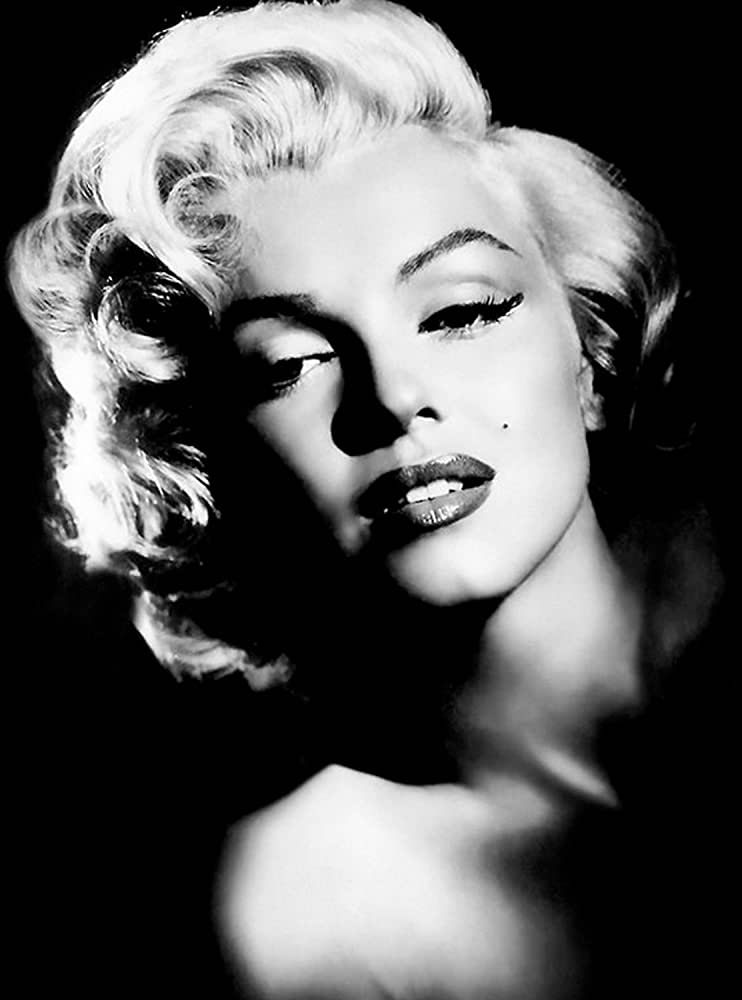
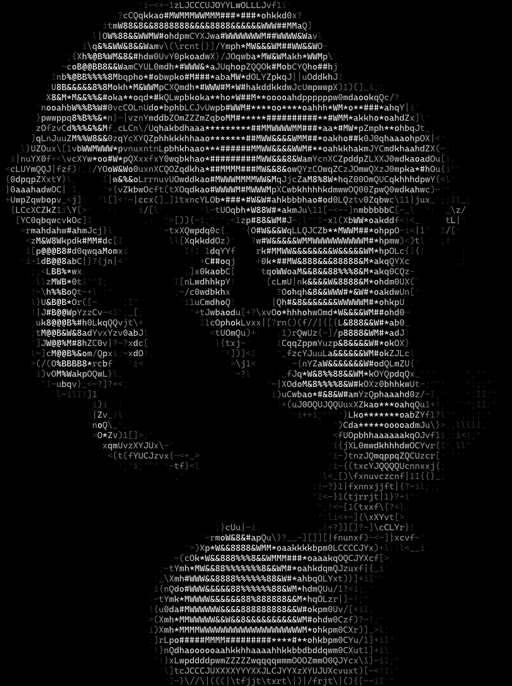
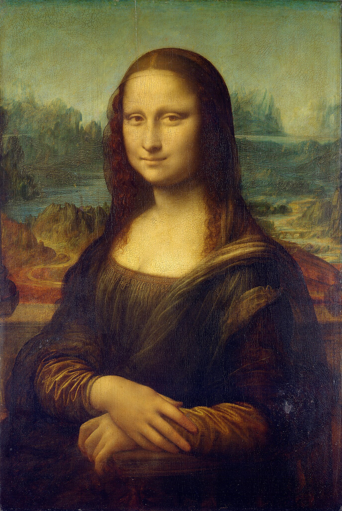
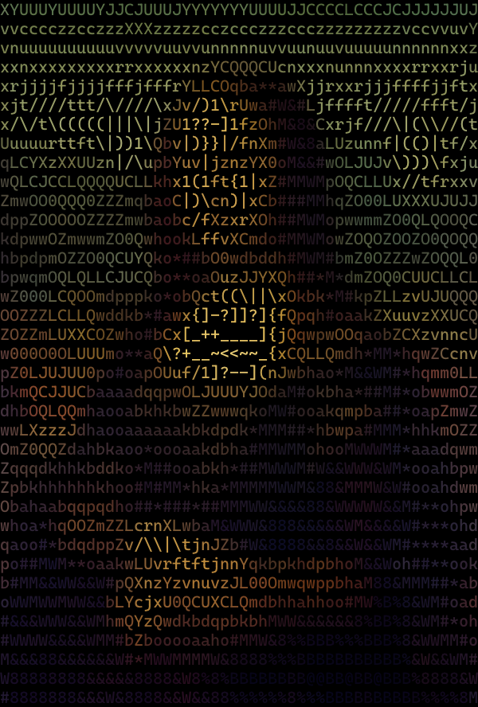
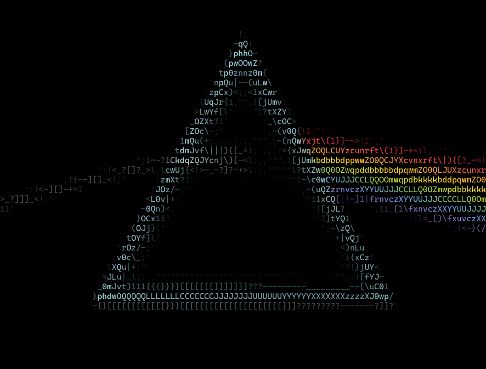
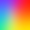
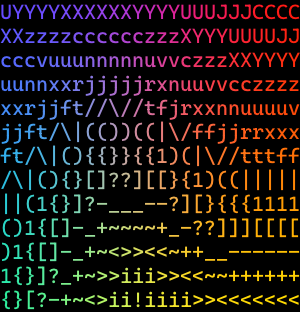

  
## 
*A command-line tool for converting images to ASCII art*

*Fork of [JosefVesely/img2ascii](https://github.com/JosefVesely/img2ascii)*
  

## Overview

img2ascii converts raster images into ASCII-art renderings. It supports colored ANSI output (24-bit RGB per character), plain grayscale text, optional PNG renderings of the ASCII using a monospaced TrueType font, and both a command-line and an interactive terminal UI.

## CLI Syntax

| Short | Long       | Parameter | Description                                   |
|-------|------------|-----------|-----------------------------------------------|
| -i    | --input    | *File*    | Input image (repeatable)                      |
| -o    | --output   | *Path*    | Output directory                              |
| -w    | --width    | *Number*  | Requested output width (characters)           |
| -m    | --max      |           | Use native image width (max resolution)       |
| -c    | --chars    | *String*  | Custom character ramp                         |
| -g    | --grayscale|           | Black and white ASCII image                   |
| -p    | --print    |           | Print the output to the console               |
| -r    | --reverse  |           | Reverse the string of characters              |
| -d    | --debug    |           | Debug info                                    |
| -P    | --png      |           | Also write a .png alongside each .txt         |
|       | --font     | *File*    | Font for PNG output (default: Cascadia Mono)  |
| -t    | --tui      |           | Launch the interactive TUI                    |

For more details, run `./img2ascii --help`.

## TUI features (interactive)

- File picker with single and multi-select modes (batch processing).
- Presets for native / half / quarter widths or a custom width field.
- Options to toggle grayscale, reverse mapping, TXT export, PNG export, and PNG HQ mode (High Quality).
- Progress bars for batch and PNG rendering.

## PNG output notes

- PNG export rasterizes glyphs from a TrueType font and composes a PNG image where each ASCII character is drawn into a cell.
- A suitable monospace TTF is required; the program attempts to locate common Windows fonts by default. Use `--font` to provide an explicit font file.
- PNG quality automatically adapts to the target grid size; very large outputs may be skipped due to library dimension limits.

## Comparison

Below are placeholder comparisons showing the typical input → ASCII output workflow.
Replace the placeholder images with real examples in `images/` or `examples/` when available.

| Input | Command | ASCII Output |
|-------|---------|--------------|
|  | `Width: 100, Reverse, PNG HQ` |  |
|  | `Width: 50, PNG HQ` |  |
|  | `Width: 100, Reverse, PNG HQ` |  |
|  | `Width: 25, PNG HQ` |  |

## Credits & License

- Fork and current maintenance: Josiah-Legg (this repository).
- Original project: JosefVesely (upstream inspiration / original implementation).
- License: MIT (see the repository `LICENSE` file).

If you republish or redistribute, please retain the original license and attribution.

---
